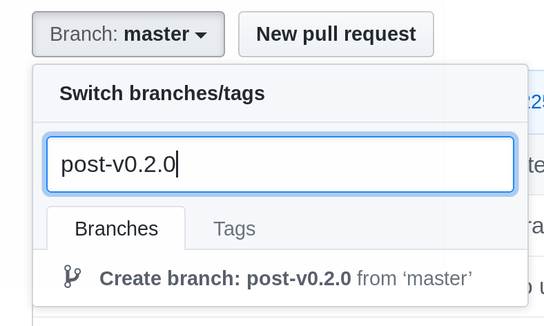

# Development and Release Process

## Development Processes

### Main

The `HEAD` of `main` branch is considered the most active development, to which new features and bug fixes are applied. The expectation is that main will always build and pass tests.
Development is incremental. It is expected that pull-requests are either:
 - complete and fully integrated into code execution path, or
 - have a feature switch which must be enabled until code completion is reached.

`HEAD` on main is expected to be in a state that it could be released.
The next major release will be tagged and released from main.
If the current released version is `v0.3.1` and the next major release is `v0.4.0`, then when it is deemed appropriate `v0.4.0` will be tagged off main, followed by a release.
From that tag work will continue on main.

*If* it is necessary in the future to have a patch release for `v0.4.1`, a branch will be created off the `v0.4.0` tag with the nomenclature of `releases/{major.minor}`, in this example `releases/0.4`.
Branches matching `releases/*` are protected branches in the repository.

The `HEAD` of the release branches follows the same conventions as main.  It is expected that `HEAD` of the release branch is always in a releasable state. The purpose of the release branch is for bug fixes only.  New features should not be targeted to a release branch.

### Documentation

Pull request for documentation (in the [`kudo.dev`](https://github.com/kudobuilder/kudo.dev) repo) should be prepared and reviewed at
the same time as the pull request for any user-visible (documentation-worthy) change.
The description for the code change PR should link to the documentation PR (and vice-versa).

The documentation PR should be made against the branch dedicated to next release, and merged as soon as its
corresponding PR(s) against the `kudo` repo is/are merged.

The name of the release-dedicated branch is `post-vx.y.z` where `x.y.z` is the *previous* release.
This gives us the ability to have each branch be used for only a single release without knowing in advance
what the exact version number will be up-front.

### Bug Fixes

Bug fixes are expected to be worked on and applied to `main`.

If the fix is needed for a previously supported release version of KUDO, then a backport is expected.
The bug fix pull request is expected to be marked with a `backport` label.
If a bug fix has to be backported to a previous version, it is expected when possible that the backport is a `git cherry-pick`, updated if necessary to conform to previous code and architecture.

On occasion a cherry-pick is too much of a burden. In this case, fix the bug as a new pull request against the release branch.
Provide the same title and details of the original pull request for traceability.

## Release Request Process

The KUDO Project is aiming to do monthly minor releases but the period could be even shorter if necessary. The process is as follows:

1. Every release should have an appointed release manager (RM)
1. RM is responsible for following the process below
1. RM should announce the release in the public [#kudo slack channel](https://kubernetes.slack.com/messages/kudo/) at least two days prior to the date
1. RM makes sure all PRs that need to go into the release are merged prior to the process starting
1. RM prepares a pre-release at least 2 days before the release process is started and makes sure it's manually tested at least in the parts where we lack automatic tests for now (pre-release should be announced in the [#kudo slack channel](https://kubernetes.slack.com/messages/kudo/))

### Release Process

The official binaries for KUDO are created using [goreleaser](https://goreleaser.com/). The [.goreleaser.yml](.goreleaser.yml) defines the binaries which are supported for each release. Goreleaser is right now run manually from the RM computer.

#### Preconditions

1. Ensure you have credential `GITHUB_TOKEN` set.
The env must include `export GITHUB_TOKEN=<personal access token>`.
[Help](https://help.github.com/en/articles/creating-a-personal-access-token-for-the-command-line) provided from Github.
The token must grant full access to: `repo`, `write:packages`, `read:packages`.
1. Ensure you are logged into Docker hub and have rights to push to kudobuilder.

#### Actual release process

1. Tag the kudo repo with expected release `git tag -a v0.2.0 -m "v0.2.0"` and push the tag `git push --tags`.
1. Invoke goreleaser `goreleaser --rm-dist`.
1. Update the GH release with release highlights and supported Kubernetes versions. There is a draft that contains categorized changes since the last release. It provides categories for highlights, breaking changes, and contributors which should be added the gorelease release notes. The changelog from the draft log is ignored. After the contents are copied, the draft can be deleted.
1. Merge the [branch](#documentation) of the [`kudo.dev`](https://github.com/kudobuilder/kudo.dev) repo dedicated to current release
   into `main`, following the regular GitHub pull request process.
1. Immediately after that, create a `post-v0.2.0` branch for documentation for a *future* release
   from the tip of `main` of the [`kudo.dev`](https://github.com/kudobuilder/kudo.dev) repo,
   for example in the GitHub UI:
   
   
1. Send an announcement email to [kudobuilder@googlegroups.com](https://groups.google.com/forum/#!forum/kudobuilder) with the subject `[ANNOUNCE] Kudo $VERSION is released`
1. Run `./hack/generate_krew.sh` and submit the generated `kudo.yaml` to https://github.com/kubernetes-sigs/krew-index/.
1. Update KUDO_VERSION [in the Makefile](https://github.com/kudobuilder/operators/blob/master/Makefile#L2) of operators repo.

**Note:** If there are issues with the release, any changes to the repository will result in it being considered "dirty" and not in a state to be released.
It is possible outside of the standard release process to build a "snapshot" release using the following command: `goreleaser release --skip-publish --snapshot --rm-dist`
This process will create a `dist` folder with all the build artifacts. The changelog is not created unless a full release is executed. If you are looking to get a "similar" changelog, install [github-release-notes](https://github.com/buchanae/github-release-notes) and execute `github-release-notes -org kudobuilder -repo kudo -since-latest-release`.

**Note:** There is value in providing a blog of highlighted features after release against [kudobuilder/kudo.dev](https://github.com/kudobuilder/kudo.dev) with a [blog post](https://kudo.dev/internal-docs/blog-index.html#release-posts). 

**Note:** The release note for a full release should contain all changes since the last non-pre-release. For example a `0.16.0` changelog should contain all changes since `0.15.3`, *not* only the changes since `0.16.0-rc2`.

### Cutting a Release Branch

As outlined above, when it is necessary to create a new release branch, it is necessary to update the [circle-ci config](https://github.com/kudobuilder/kudo/blob/main/.circleci/config.yml) to test merges against the correct branch. It is necessary replace all references to `main` with the appropriate release branch.

### Cutting a Patch Release

When cutting a patch release, for example `v0.3.3`, it is necessary to ensure that all bugs fixed on main after `v0.3.2` have landed on the release branch, `releases/0.3` in this case.

### Cutting a pre-release

Cutting  pre-release is very similar to cutting a stable release. That is because our `.goreleaser.yml` contains `prerelease: auto` which automatically detects a pre-release if the tag name looks like a pre-release.

For pre-releases, we're not pushing docker images to the official repo. This is intentional because the following setting is set in `.goreleaser.yml` - `dockers.skip_push: auto`. That is because for pre-release, we don't want to update the latest tag just yet. Even though there is no push, goreleaser still builds the images for you.

This is the full pre-release step by step:
1. Ensure you have credential `GITHUB_TOKEN` set. The env must include `export GITHUB_TOKEN=<personal access token>`. [Help](https://help.github.com/en/articles/creating-a-personal-access-token-for-the-command-line) provided from Github. The token must grant full access to: repo, write:packages, read:packages.
1. Ensure you are logged into Docker hub and have rights to push to kudobuilder.
1. Tag repo with expected pre-release (the name of the tag has to contain e.g. rc1 or similar) `git tag -a v0.2.0-rc1 -m "v0.2.0-rc1"`  && push tag `git push --tags`.
1. Invoke goreleaser `goreleaser --rm-dist`.
1. Push only versioned docker image via `docker push kudobuilder/controller:v0.2.0-rc1`

**Note:** The release notes for a pre-release should contain all changes since any previously released version. For example `0.16.0-rc1` should list all changes since `0.15.3` if that was the latest `0.15` release. `0.16.0-rc2` would contain all changes since `0.16.0-rc1`.
